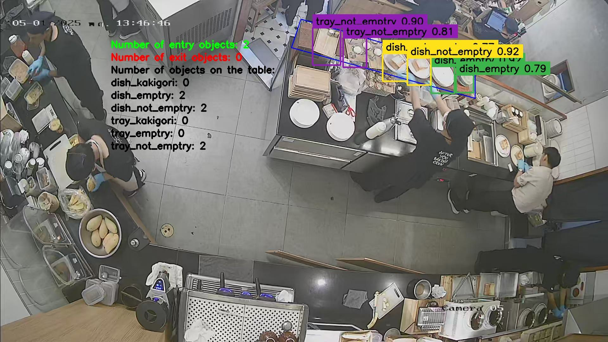

# ChefOps - Chef Operations Architecture

This is a simple detecting and tracking Food web app in dispenser area in kitchen of a restaurant.

See a demo of the web app and how to use it here: [Demo](https://youtu.be/beFgcKEdK74)



### 🔧 Components
- Python (Flask, OpenCV, threading)
- JavaScript (vanilla JS + HTML)
- YOLOv5 + MobileNetV3
- Base64 image transfer + annotation
- Feedback system with image + text

## 1 - System model

### 1.1 - 📲 Web Diagram Structure

Reasons why a web app was chosen to be developed in this project: Build a platform to build a system that users can easily access and use on many different devices (including devices without CPU).


```plaintext
User Browser
   │
   ▼
[HTML + JS Frontend]
   │ └─> Fetches video info (/video_info)
   │ └─> Sends / receives frames (/get_frame)
   │ └─> Posts feedback (/submit_button)
   │ └─> Selects videos (/load_video)
   ▼
[Flask Web Server]
   │
   ├─> [Load Video Request]
   │     └─ Spawns Processing Thread
   │
   ├─> [Processing Thread]
   │     ├─ Reads video via OpenCV
   │     ├─ Applies Detection (DetectObject)
   │     └─ Stores frames in a Queue
   │
   ├─> [get_frame Route]
   │     └─ Pulls frame from Queue, encodes as JPEG
   │
   ├─> [submit_button Route]
   │     └─ Saves feedback image and text to backend
   │
   └─> [video_info Route]
         └─ Sends metadata: total frames, fps

```

### 1.2 - 🧠  AI Architecture: Object Detection & Tracking

```plaintext
Video Frame Input
   │
   ▼
[YOLO Model]
   │  └─> Detects objects
   │    - Bounding boxes
   │    - Class labels
   ▼
[MobileNetV3 Model]
   │  └─> Refines or classifies detections
   ▼
[Final Detection Result]
   │  └─> Annotated frame with results (boxes, labels)
   ▼
[Return to Frontend]
   └─> Displayed as JPEG image


```
In this project, the YOLOv8x model is employed for object detection tasks. YOLO (You Only Look Once) is an open-source framework known for its high processing speed and accuracy, making it well-suited for real-time applications. Among the YOLOv8 family, the 'x' variant offers the highest accuracy, ensuring reliable detection of objects in various scenarios.

Once objects are detected—with both class labels and bounding boxes—the MobileNetV3 Large model is utilized for fine-grained classification of object classes. MobileNetV3 Large is chosen due to its efficient computational performance and low hardware requirements, making it ideal for integration in resource-constrained environments.

Following classification, the YOLO tracking module is applied to count the number of objects present on the table within the distribution area. Additionally, the system monitors and quantifies how many objects are placed onto and removed from the table over time.

⚠️ Note: Currently, the number of objects being removed from the table—especially trays being taken away for service—is undercounted. This is due to the YOLO model's failure to detect objects as they are being removed from the table , which stems from the lack of training data for this specific scenario. In future updates, the dataset should be expanded to include such cases, followed by retraining the detection model accordingly.

## 2 - ⚙️ System configuration

The system is built under Kali Linux operating system.
Hardware is supported by NVIDIA GeForce GTX 1060 6GB. 
Driver Version: 535.247.01. CUDA Version: 12.2.

If you run on another operating system, you may need to install the system so that CUDA can support the YOLO model and MobileNet-v3-Large.

If running on CPU only, you may encounter lag problems.

## 3 - 🛠️ Install 🛠️

### 3.1 - Train models 🚀🚀🚀

Since my GPU is not powerful enough, and preparing for training the model with large data, I uploaded the training data to drive and used colab's free GPU to train the model at [Notebook](https://colab.research.google.com/drive/1BQBtCAfZXa7VZ3tKhATG5o_w6OgUP3YL?usp=drive_link).

I then downloaded the trained models and saved them in **./backend/models/trainedmodels**
You can also download the models at:
1. [yoloDetect_x.pt](https://drive.google.com/file/d/1boh8GyscJqu-oZ2oxUlu5as24CEPiiYX/view?usp=sharing)
2. [mobilenetV3Config.pt](https://drive.google.com/file/d/10rYp7slU9RzE9UrXWze6Cu2ThsNaHwbj/view?usp=drive_link)

### 3.2 - 📦 Create and run docker server

Your operating system needs to be able to run docker and docker compose. If your operating system doesn't have docker, make sure to installed docker.

Before creating and launching the docker container you need to upload your video to **./backend/videos** and add the video name to the file **video_list.txt**

Then run the command:
<pre><code>sudo docker-compose up --build -d </code></pre>

The web will run in debug mode. To find the link to access the website you can wait a few seconds after the docker container is successfully launched and enter the command to view the container log:
<pre><code> sudo docker logs chefops-container </code></pre>

If you want to disable the website, you can use the following command to stop the docker container: <pre><code> sudo docker stop chefops-container    </code></pre>

If you want to turn the website back on:
<pre><code> sudo docker start chefops-container    </code></pre> 
