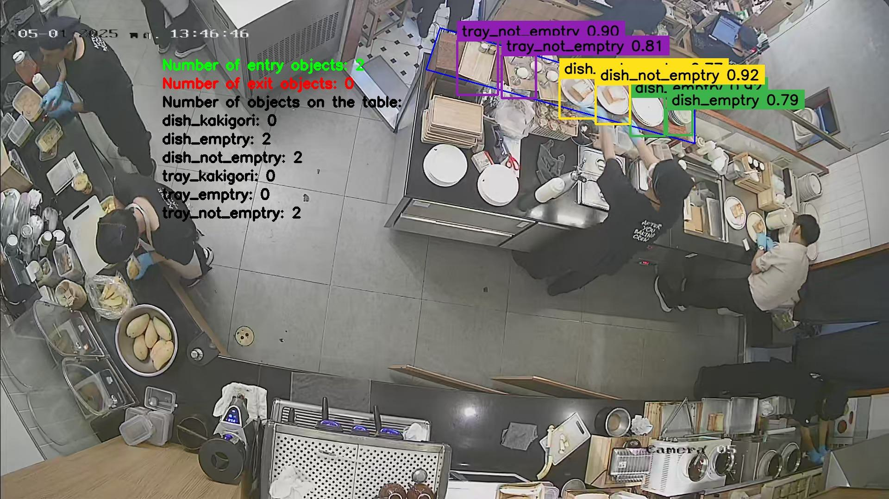

# ChefOps - Chef Operations Architecture

This is a simple detecting and tracking Food web app in dispenser area in kitchen of a restaurant.

### 🔧 Components
- Python (Flask, OpenCV, threading)
- JavaScript (vanilla JS + HTML)
- YOLOv5 + MobileNetV3
- Base64 image transfer + annotation
- Feedback system with image + text

## System model

### Web Diagram
[User Browser]
|
v
[Frontend: HTML + JS]
|
|-- fetch('/video_info') ---> [Flask Backend: /video_info]
|-- fetch('/load_video') ---> [Flask Backend: /load_video]
|-- fetch('/get_frame') ---> [Flask Backend: /get_frame]
|-- fetch('/submit_button') --> [Flask Backend: /submit_button]
|
v
[Flask Backend]
|
|-- Starts Thread --> [Video Processing Thread]
| |
| |-- OpenCV reads frames
| |-- YOLO/MobileNet Detection
| |-- Puts into Frame Queue
|
|-- /get_frame reads frame from Queue
|-- /submit_button saves feedback (image + text)
|
v
[Disk Storage]
├─ feedback/img/.jpeg
└─ feedback/userfeedback/.txt

### 🧠 AI Architecture: Object Detection & Tracking

[Input Frame]
|
v
[YOLO Model]
(Object Detection)
|
v
[Bounding Boxes]
|
v
[MobileNetV3 Model]
(Optional Classification / Refinement)
|
v
[Annotated Frame with Detections]

## System configuration

The system is built under Kali Linux operating system.
Hardware is supported by NVIDIA GeForce GTX 1060 6GB. 
Driver Version: 535.247.01. CUDA Version: 12.2.

If you run on another operating system, you may need to install the system so that CUDA can support the YOLO model and MobileNet-v3-Large.

If running on CPU only, you may encounter lag problems

## Setting

